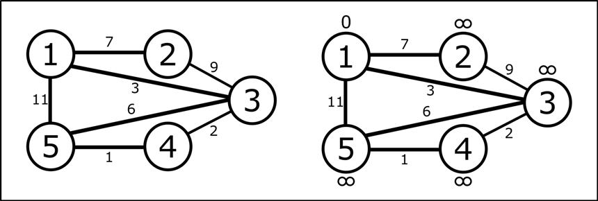
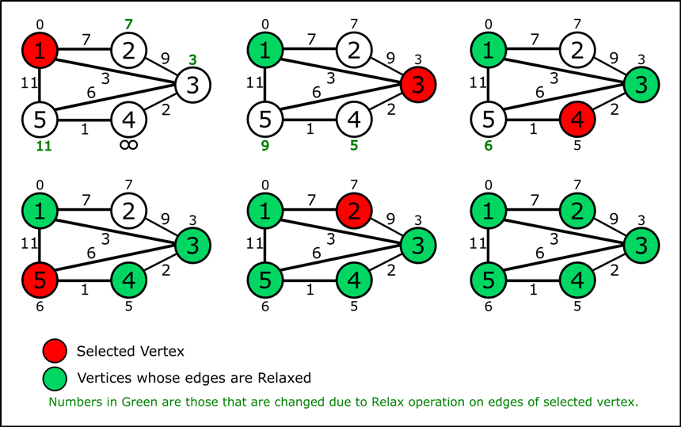

### Problem
Find the shortest paths from source vertex to all the vertices of the graph.


*Photo by [Mandy Choi](https://unsplash.com/@mandddysweettt?utm_source=unsplash&amp;utm_medium=referral&amp;utm_content=creditCopyText) on Unsplash*
### About Algorithm
We have to find the shortest paths from a starting vertex to all the other vertices, here shortest path means sum of weights of all the edges in the path (cost) should be minimum. Dijkstra's Algorithm uses greedy approach to solve this problem. In dijkstra's algorithm we use relax operation which performs a check weather going from current vertex to a neighbouring vertex will reduce the path cost of reaching the neighbouring vertex.
```cpp
relax(u,v,cost[u][v]){
    if(dist[v]>dist[u]+cost[u][v]){
		dist[v]=dist[u]+cost[u][v];
    }
}
```
dist[v] = distance between source vertex to vertex ‘v’ so far.

dist[u] = distance between source vertex to vertex ‘u’ so far.

cost[u][v] = weight of edge (u,v).

This means we are checking weather going to vertex ‘v’ from some vertex ‘u’ will improve the path for reaching vertex ‘v’ or not.

### Algorithm
In dijkstra's algorithm each vertex will be assigned a number and algorithm updates this number for each vertex. When algorithm completes, this number is going to be the shortest path from source to that vertex. Let call this number dist[u], and in the beginning for source vertex this number is given value 0 (dist[s]=0) and for all other vertices it is given largest possible value (dist[u]=INT_MAX). We select the vertex ‘u’ with shortest value of dist[u] and relax all the edges from that vertex to all those vertices which are not selected yet, in the beginning this vertex will be source vertex. When a vertex ‘u’ is selected the value of dist[u] is the shortest path form source to vertex ‘u’. 
```sh
dijkstra(g,w,s){
  	//g is given Graph.
  	//w is Weight Matrix of the Graph.
  	//s is Source Vertex.
  	initializeVertices(g,s);		//Initialize dist[s]=0 and other vertices to INT_MAX
  	q=buildHeap(g);					//returns a Min-Heap containing vertices of graph based on values of dist[u] 
	
	while(!q.empty()){
    	u=extractMin(q);			//returns vertex ‘u’ with minimum dist[u] in O(log V)
		//selectedVertices is a set of vertices to which shortest distance is obtained.
		selectedVertices.add(u); 
		
    	for each vertex ‘v’ adjacent to ‘u’
	  		relax(u,v,w[u][v]);
  	}
}
```
### Example
In the following graph we assign zero to source vertex and infinite (INT_MAX) to all other vertices.




Now, we select the vertex (vertex in red colour) with lowest number (source vertex in the beginning), then relax the outgoing edges from this vertex. After this relax operation number assigned to some vertices will be changed (Numbers in green colour), this means we get a better path when we reach to them through selected vertex. Again we will select a vertex with lowest number which in not yet selected and perform relax operation on all the outgoing edges that does not reach any vertices which was selected in previous iterations (vertices in green colour). We repeat this step till all the vertices are selected.




### Extras
We can't find the shortest path from source vertex to every vertex using dijkstra's algorithm if:
- Graph is disconnected
- Graph contains negative weight cycle (sum of weight of each edge of the cycle is negative).

Dijkstra Algorithm can be used on graphs with negative weighted edges but there should be no negative weight cycle. In general we don’t use dijkstra's algorithm on graphs containing negative weight edges because if there are negative weight edges, there could be negative weight cycle(s) in the graph.

### Complexity
Implementing Dijkstra Algorithm using Min-Heap we get: 
- Time Complexity = O(E log V)
- Space Complexity = O(V)

Where, E = Number of Edges and V = Number of Vertices.
