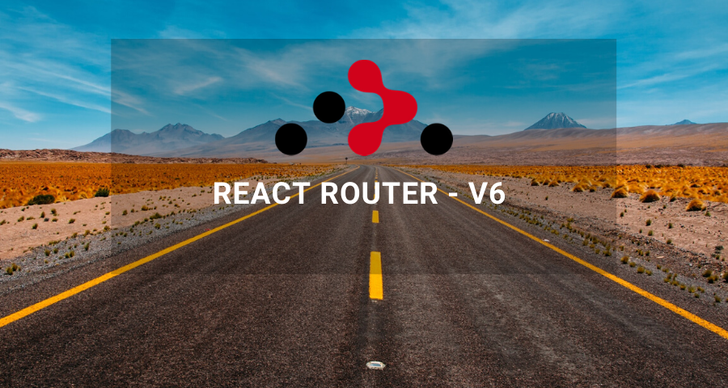
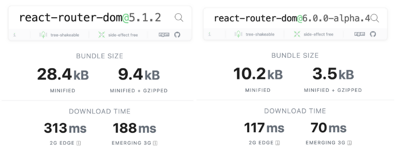

Version 6 of React Router is in alpha right now, and we can expect some major changes in its upcoming release.

#### Installation
```
npm install react-router@next react-router-dom@next
```

### 1. \<Routes> is the new \<Switch>

The \<Routes > is the new \<Switch> element now. It is very much similar to \<Switch> with some new features.

```javascript
// old - v5
import { BrowserRouter, Switch, Route } from 'react-router-dom';
const App = () => {
  return (
    <BrowserRouter>
      <Switch>
        <Route exact path="/" component={Home} />
        <Route path="/users" component={Users} />
      </Switch>
    </BrowserRouter>
  );
}
// new - v6
import { BrowserRouter, Routes, Route } from 'react-router-dom';
const App = () => {
  return (
    <BrowserRouter>
      <Routes>
        <Route path="/" element={<Home />} />
        <Route path="users" element={<Users />} />
      </Routes>
    </BrowserRouter>
  );
}
```

Did that component prop got changed to element?  
That brings us to our second highlight.

### 2. \<Route component> is replaced with \<Route element>

If you notice in the above example, in the new version we are passing a react element instead of a component. This is so much better, now we can pass props directly to the element.

```javascript
// old - v5
<Route exact path="/" component={Home} />
<Route path="/users" render={routeProps => (
    <Users isCustomLayout={true} />
  )}
/>
// new - v6
<Route path="/" element={<Home />} />
<Route path="users" element={<Users isCustomLayout={true} />} />
```

### 3. No more exact and strict props

Yes, you read it right. In v6 all the routes match exactly by default.

```javascript
// old - v5
<Route exact path="/" component={Home} />
// new - v6
<Route path="/" element={<Home />} />
```

### 4. Relative paths and links

In v6, both paths and links are relative to their parent route. This means we can omit the “/” if we want the relative path.

```javascript
// old - v5
<Route exact path="/" component={Home} />
<Route path="/users" component={Users} />
// new - v6
<Route path="/" element={<Home />} />
<Route path="users" element={<Users />} />
```

What about nested routes then? They just got better.

### 5. Easier Nested Routes

Just like your regular react elements we just need to wrap the child route with a parent one.

```javascript
// old - v5
<Route exact path="/" component={Home} />
<Route path="/users" component={Users} />
// ....
users.js
import { useRouteMatch } from 'react-router-dom';
const Users = () => {
  const { path } = useRouteMatch();
return (
    <div>
      // you can do something here
      <Switch>
        <Route path={`${path}/:id`} component={UserInfo} />
        <Route path={`${path}/profile`} component={UserProfile} />
      </Switch>
    </div>
  );
}
// new - v6
<Route path="/" element={<Home />} />
<Route path="users" element={<Users />}>
  <Route path=":id" element={<UserInfo />} />
  <Route path="profile" element={<UserProfile />} />
</Route>
// ....
users.js
import { Outlet } from 'react-router-dom';
const Users = () => {
  return (
    <div>
      // you can do something here
      // Outlet: This element is used as a placholder for the child route.
      // Which means it will be either <UserInfo /> or <UserProfile />
      <Outlet />
    </div>
  );
}
```

### 6. Future-ready useNavigate instead of useHistory

No more history, it’s time to navigate. The useHistory hook is now replaced with the suspense-ready useNavigate hook.

```javascript
// old - v5
import { useHistory } from 'react-router-dom';
const CustomButton = props => {
  const history = useHistory();
  const handleClick = () => {
    history.push('/users');
  }
  return <button onClick={handleClick}>{props.label}</button>;
}
// new - v6
import { useNavigate } from 'react-router-dom';
const CustomButton = props => {
  const navigate = useNavigate();
  const handleClick = () => {
    navigate('/users');
  }
  return <button onClick={handleClick}>{props.label}</button>;
}
```

### 7. Bundle size — 28.4 kB to 10.2 kB

With all these awesome changes, there is also icing on the cake. They have reduced the bundle size by more than 50%.

