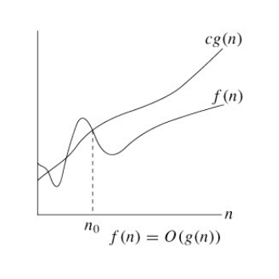
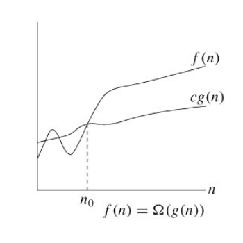
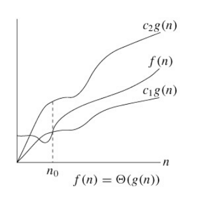

### What are Asymptotic Notations?
Asymptotic notations are used to represent the complexities (time & space) of algorithms for asymptotic analysis.

There are three notations that are mostly used:
- **Big Oh Notation (O)**
- **Big Omega Notation (Ω)**
- **Big Theta Notation (Θ)**

### Big Oh (O)
**Big Oh Notation (O)**  
The Big O notation defines the upper bound of an algorithm.

**Mathematically defined as:**  
O(g(n)) = { *f(n): there exist positive constants c and n0 such that 0 <= f(n) <= c * g(n) for all n >= n0* }  
**Graphical Representation:**  
  

### Big Omega (Ω)
**Big Omega Notation (Ω)**  
The Big Omega notation defines the lower bound of an algorithm.

**Mathematically defined as:**  
O(g(n)) = { *f(n): there exist positive constants c and n0 such that 0 <= c * g(n) <= f(n) for all n >= n0* }  
**Graphical Representation:**  
  

### Big Theta (Θ)
**Big Theta Notation (Θ)**

The Big Theta notation defines both, upper & lower bound of an algorithm.

**Mathematically defined as:**  
O(g(n)) = { *f(n): there exist positive constants c1, c2 such that 0 <= c1 * g(n) <= f(n) <= c2 * g(n) for all n >= n0* }  
**Graphical Representation:**  
  
