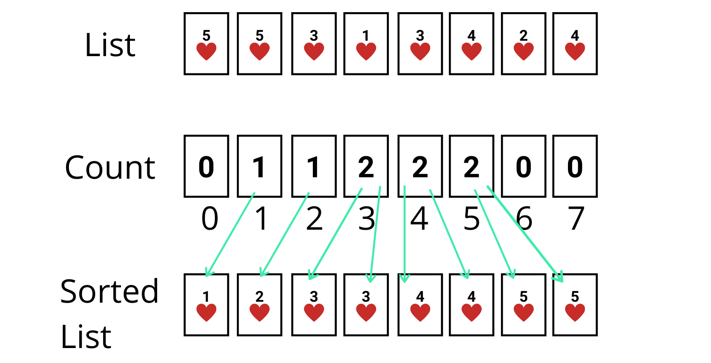

What if, I store the frequencies of distinct elements of the list and then use that stored frequency list to produce a sorted list?  

That’s what counting sort is.  

In this algorithm, we store the frequencies (count) of distinct elements of the list by mapping the value as an index of the frequency list. Then the frequency list is used to create a sorted list by counting the elements from start to the end of the list.  


*How I think of counting sort*


### Naming
The name **Counting sort** is used because it works by counting distinct elements in the unsorted list.

### Performance
It is not a comparison-based sorting algorithm. It works by storing the frequencies of distinct elements on the basis of the index. So, it will take a lot of space if the input ranges to the higher end. Let's consider **K** as the range of the non-negative key values.

|Case|Complexity
|----------------|--------------
**Best case time complexity**| $Ω(n + k)$ 
**Average case time complexity**|$Θ(n + k)$
**Worst case time complexity**|$O(n + k)$
**Worst case space complexity**|$O(k)$

**Note:** Counting sort is a stable sorting algorithm.  
What is stability in the sorting algorithm?
[Find out here](https://en.wikipedia.org/wiki/Sorting_algorithm#Stability)


### Implementation
```javascript
function countSort(list) {
    const max = Math.max(...list), min = Math.min(...list);
    const offset = Math.abs(min);
    const range = max + offset + 1;
    const count = new Array(range).fill(0);
    const output = [];
    list.forEach(num => {
        count[num + offset] += 1;
    });
    for (let num = min; num <= max; num += 1) {
        while(count[num + offset] > 0) {
            output.push(num);
            count[num + offset] -= 1;
        }
    }
    return output;
}
```

### Visualization
