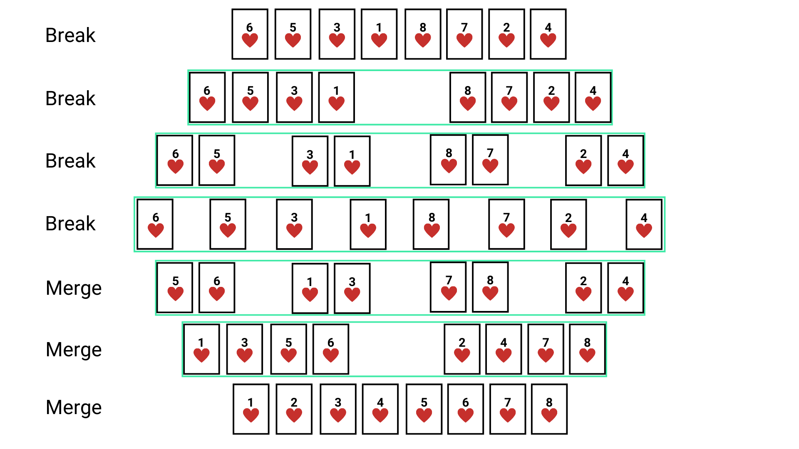

Sometimes the best way to solve a problem is to **break it down** *(divide)* into smaller problems, then solve those smaller problems separately, and finally **merge** *(conquer)* the solutions to solve the original problem. This approach is known as **Divide and Conquer**.

That's why Merge sort is one of the most efficient sorting algorithms. It works on the idea of divide and conquer. It breaks the list into several sublists until each sublist consists of a single element and then it merges those elements while placing them in sorted order.


*How I think of merge sort*


### Naming
It's obvious that the name **Merge sort** is because it works by *merging* the separated elements in sorted order.

### Performance
It's faster than sorting algorithms like the bubble sort, selection sort, and the insertion sort. However, the extra linear space required to merge sublists into a sorted list is a drawback of merge sort.

|Case|Complexity
|----------------|--------------
**Best case time complexity**| $Ω(nlog(n))$ 
**Average case time complexity**|$Θ(nlog(n))$
**Worst case time complexity**|$O(nlog(n))$
**Worst case space complexity**|$O(n)$

**Note:** Merge sort is a stable sorting algorithm.
What is stability in the sorting algorithm?
[Find out here](https://en.wikipedia.org/wiki/Sorting_algorithm#Stability)


### Implementation
```javascript
function mergeSortedList(leftList, rightList) {
    let sortedList = [];
    // create sorted array with left and right sublist
    while(leftList.length && rightList.length) {
        if (leftList[0] <= rightList[0]) {
            sortedList.push(leftList.shift());
        } else {
            sortedList.push(rightList.shift());
        }
    }

    // add the remaining elements, if any
    if (leftList.length) {
        sortedList = sortedList.concat(leftList);
    }
    if (rightList.length) {
        sortedList = sortedList.concat(rightList);
    }
    return sortedList;
}

function mergeSort(unsortedList) {
    const list = [...unsortedList];
    // base case
    if (list.length <= 1) {
        return list;
    }
    const middle = Math.floor(list.length / 2);
    const leftList = list.slice(0, middle);
    const rightList = list.slice(middle, list.length);

    const leftSortedList = mergeSort(leftList); // left sublist
    const rightSortedList = mergeSort(rightList); // right sublist
    return mergeSortedList(leftSortedList, rightSortedList);
}
```

### Visualization
