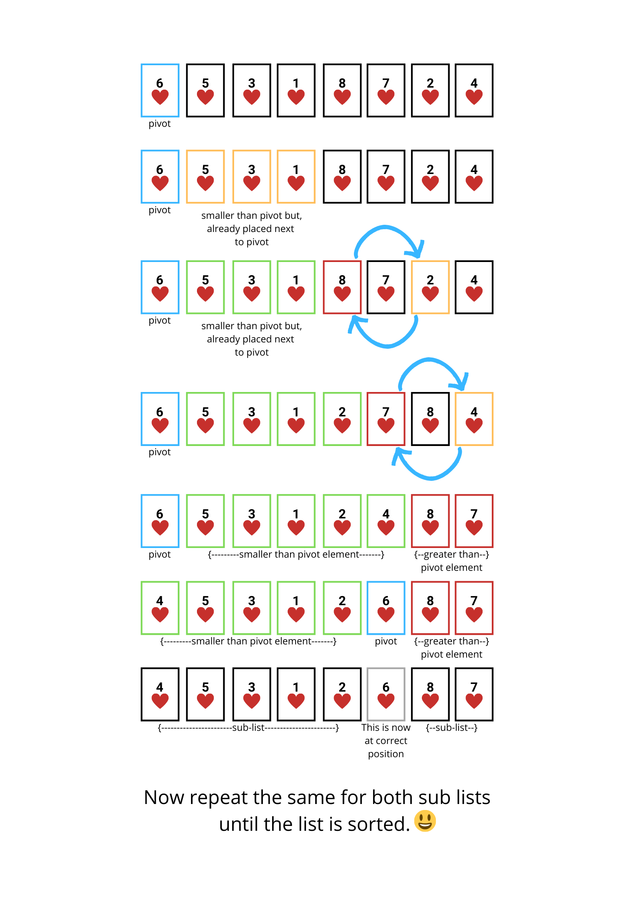

Just like Merge sort, it works on the idea of divide and conquer approach. It works on the idea of choosing one of the elements as a pivot element and then, partitioning the rest of the elements around it in this way.  

[smaller elements on the left] <[pivot element] ≤ [larger elements on right]  

**Me:** Simple right?  
**Someone:** 😐No  
**Me:** 😄Maybe yes, that's because it's a bit different from others.  

Let see how it works.  

The first step is to choose an element as a pivot element. This pivot element will be used to compare so that we can place **smaller elements on its left side** and **larger or equal elements on its right side.**

**Question:** How we’ll choose an element as a pivot?  
**Answer:** There are many different ways to do that, like  
- Choose the first element as a pivot. (We’ll use this one)
- Choose the last element as a pivot.
- Choose the middle element as a pivot.
- Choose a random element as a pivot.

Pick the first element as a pivot element.  
Then we’ll traverse the rest of the array i.e., from the second element *(pivotIndex + 1)* to the end of the list.    
While traversing we’ll check if there is any element smaller than the pivot element, if yes then we’ll swap it with the second element *(pivotIndex + 1)*.
Again if we find any other element which is smaller than the pivot element then, we’ll swap it with the third element *(pivotIndex + 2)* and so on for other elements *(pivotIndex + noOfElementsSmallerThanPivot)*.    
Now that we have swapped all the elements smaller than the pivot element, we can place the pivot element at such a position *(pivotIndex + noOfElementsSmallerThanPivot)* so that all the smaller elements will be on its left side and elements greater than or equal will be on its right.  

Now that pivot element is at the correct position and has divided the list into two sublists, one of smaller elements and the other of greater elements. Now we can repeat the same process on each of the sublists until the list is sorted.



### Naming
Quick sort is also known as **partition exchange sort**. Also, the name **quick** sort is because of the fact that this sorting algorithm is better than other common sorting algorithms.

### Performance
It’s one of the most efficient sorting algorithms. As its worst-case time complexity is O(n²) and its space complexity is O(log(n)). However, there is a variation of quick sort known as **randomized quick sort**, whose worst-case time complexity is O(nlogn).

|Case|Complexity
|----------------|--------------
**Best case time complexity**| $Ω(nlog(n))$ 
**Average case time complexity**|$Θ(nlog(n))$
**Worst case time complexity**|$O(n^2)$
**Worst case space complexity**|$O(log(n))$

**Note:** Quick sort is a stable sorting algorithm.
What is stability in the sorting algorithm?
[Find out here]([https://en.wikipedia.org/wiki/Sorting_algorithm#Stability](https://en.wikipedia.org/wiki/Sorting_algorithm#Stability)).


### Implementation

```javascript
function partition (list, start, end) {
  const pivotValue = list[start]; // first element as pivot
  const pivotIndex = start;
  let storeIndex = start + 1;
  for(let i = start + 1; i < end; i++) {
    if (list[i] < pivotValue) {
      [list[storeIndex], list[i]] = [list[i], list[storeIndex]];
      storeIndex++;
    }
  }
  [list[pivotIndex], list[storeIndex - 1]] = [list[storeIndex - 1], list[pivotIndex]];
  return storeIndex - 1;
}
function quickSort(list, start, end) {
  if (start >= end) {
    return list;
  }
  // get pivot/partition index
  pivotIndex = partition(list, start, end);
  quickSort(list, start, pivotIndex); // left list
  quickSort(list, pivotIndex + 1, end); // right list
  return list;
}
```

### Visualization


